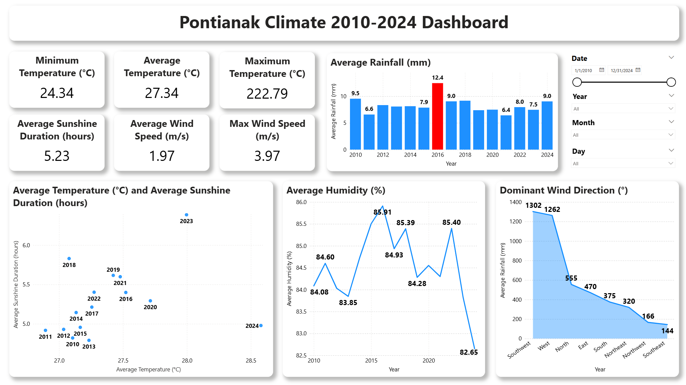

# Pontianak Climate Dynamics Analysis (2010-2024)

A data analysis and visualization project aimed at analyzing long-term climate trends and patterns in Pontianak, Indonesia. The project workflow includes data cleaning using Python (Pandas) and the creation of an interactive dashboard using Power BI.

---

## 📊 Dashboard

---

## 🎯 Project Description & Goal

As a city located on the equator, Pontianak has a unique climate dynamic. This project aims to perform an exploratory data analysis (EDA) on historical climatological data (2010-2024) to identify long-term trends, seasonal patterns, and the relationships between various weather parameters. The goal is to present these findings in an easy-to-understand, interactive dashboard that provides insights into local climate change.

---

## 🛠️ Workflow

This project is divided into two main stages to leverage the strengths of each tool:

1.  **Data Cleaning & Preparation (Python):**
    * Raw climate data was loaded using the Pandas library.
    * Data cleaning was performed, including handling non-standard missing values (`8888`, `9999`, `-`) which were converted to `NaN`.
    * Missing data was filled using the backward fill (`bfill`) method, a suitable approach for time-series data.
    * Column names were renamed into a descriptive English format (e.g., `Tavg` became `Avg Temperature (°C)`).
    * Wind direction abbreviations (`DDD_CAR`) were mapped to their full names (e.g., `SW` became `Southwest`).
    * The final output is a clean CSV file (`pontianak_climate_cleaned.csv`) ready for visualization.

2.  **Visualization & Dashboard (Power BI):**
    * The cleaned data was imported into Power BI.
    * An interactive dashboard was built to visualize key findings, with the following features:
        * **KPI Cards:** Displaying a summary of key metrics like Average Temperature and Total Rainfall.
        * **Trend Graphs:** Analyzing changes in temperature and rainfall over the years.
        * **Distribution Analysis:** Showing the frequency of weather events (e.g., how many days had heavy rainfall).
        * **Wind Analysis:** Visualizing the most dominant wind directions.
        * **Slicers:** Interactive filters by **Year** and **Month** for dynamic data exploration.

---

## 💡 Key Insights

The dashboard is designed to answer key questions such as:
* Is there a long-term trend of increasing or decreasing average temperatures in Pontianak over the last 14 years?
* Which months consistently represent the peak of the rainy and dry seasons?
* What is the relationship between air humidity and rainfall?
* From which direction does the wind most frequently blow in Pontianak?

---

## 🔧 Tools Used

* **Python:** For data cleaning and transformation.
    * *Libraries:* Pandas, NumPy, Matplotlib, Seaborn
* **Power BI:** For creating the interactive dashboard.
    * *Language:* DAX (for creating measures and calculated columns)
* **Jupyter Notebook:** As the working environment for data analysis in Python.

---

## 🚀 How to Run

1.  **View the Dashboard:** The main dashboard screenshot is included above.
2.  **Explore the Power BI File:** Download the `.pbix` file and open it using Power BI Desktop to interact with the full dashboard.
3.  **Run the Python Code:** Open the `pontianak-climate.ipynb` file using Jupyter Notebook to review the data cleaning and analysis process. Ensure you have the raw data file in the same folder.
